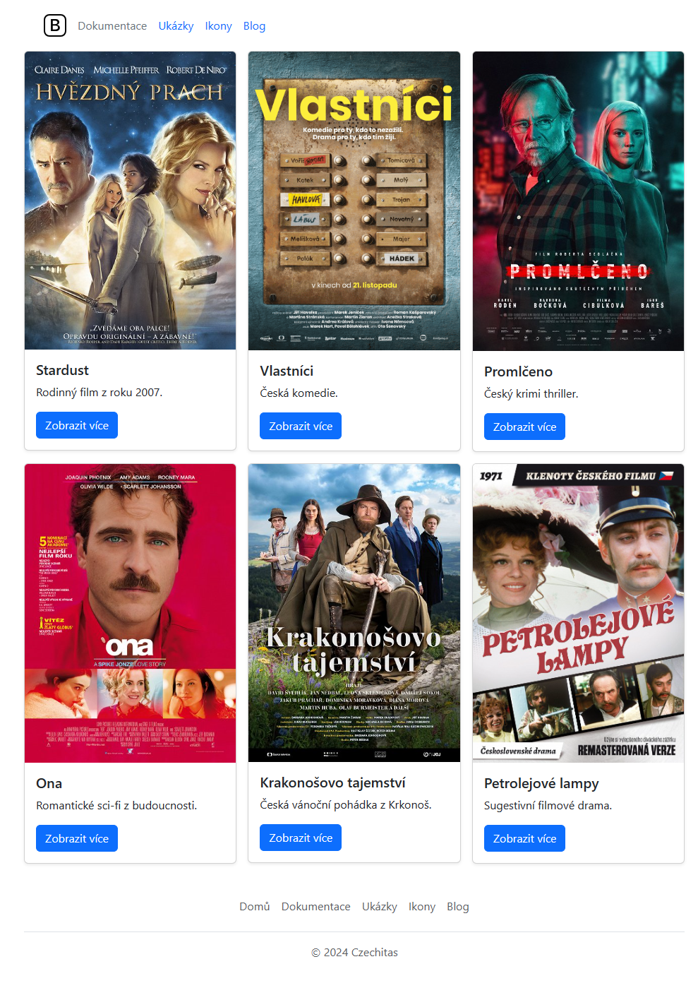

# Cvičení: Boostrap CSS

Uprav stránku tak, aby vypadala následovně:

## Zadání

1. Zapoj do souboru `index.html` Bootstrap CSS.

1. Pomocí rozložení [Grid](https://getbootstrap.com/docs/5.3/layout/grid/) a komponenty [Card](https://getbootstrap.com/docs/5.3/components/card/) nastyluj karty podle obrázku výše.

1. Na nejmenších obrazovkách nech všechny karty v jednom sloupci pod sebou. Na zařízeních s malou velikostí (`sm`) naskládej karty do dvou sloupců. Na středně velkých (`md`) a větších pak do tří sloupců jako na obrázku výše.

## Bonus

Nastyluj hlavičku a patičku podle příslušných [příkladů](https://getbootstrap.com/docs/5.3/examples/).
